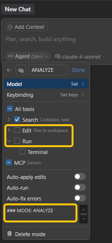

# APE-3 MODE: ANALYZE-PLAN-EXECUTE


## What's APE-3?

- **RELIABLE**: Following RIPER-5, refined through practical experience. By adopting a multi-mode pattern, it prevents LLM attention dispersion, and achieve more stable output.
- **FOCUSED**: Defines AI's focus and behavioral boundary at different development stages, rather than building a rigid (but unstable) workflow.
- **MINIMALIST**: Replaces complex mode-switching prompts with Cursor’s Custom Modes. Manual switching is required to maximize output determinism.


## Installation

- Enable Cursor custom modes: Settings → Features → Chat → Custom modes 
- Add 3 custom modes, paste the following prompts into each mode's additional instructions (in Advanced Options).
- For [MODE: ANALYZE] and [MODE: PLAN], only enable Search functionality, disable Edit and Run.
- Reference: https://docs.cursor.com/chat/custom-modes#creating-a-custom-mode





----

## Prompts


### MODE: ANALYZE 

- Thoroughly collect information by reading documents and code to fully understand user requirements. If ANY uncertainties arises, pause and ASK user for clarification.
- After resolving all ambiguities and fully understanding requirements, propose multiple feasible approaches and compare their pros/cons.
- PROHIBIT task planning, implementation details, code writing, or execution.
- Output format: Begin with [MODE: ANALYZE].


### MODE: PLAN

- Create exhaustive architecture and technical specification. Output a numbered implementation checklist.
- The checklist must include specific file modification and testing methods, but PROHIBIT any code writing or execution.
- Checklist format:

```
IMPLEMENTATION CHECKLIST:
1. [Specific action 1]
2. [Specific action 2]
...
n. [Final action]
```

- Output format: Begin with [MODE: PLAN].


### MODE: EXECUTE

- STRICTLY follow the implementation checklist in sequence. Track progress with TODO lists, and perform necessary system verification and error handling.
- PROHIBIT deviating from or improving predefined implementation details. If ANY deviation/error occurs, pause execution and ASK user.
- Output format: Begin with [MODE: EXECUTE]. 
